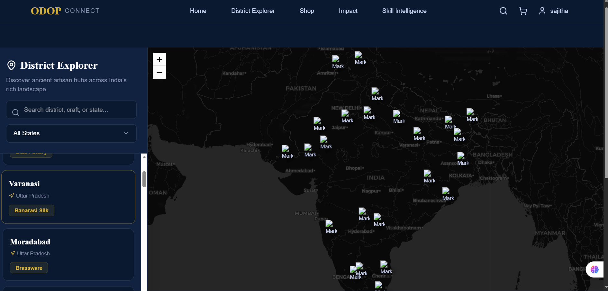

# ODOP Project
Built with React • Firebase • Tailwind CSS • Interactive Maps

## Overview
The ODOP (One District One Product) Project is a modern full-stack web application designed to promote and showcase district-wise local products, empower artisans, and support regional economic growth through digital accessibility.

The platform includes interactive district exploration, product discovery, map integration, artisan dashboards, analytics, and an intelligent shopping experience.

---

## Features

- District-wise product exploration
- Interactive map integration for district navigation
- Location-based product discovery
- Artisan and user authentication
- Interactive product marketplace
- Shopping cart and checkout system
- Skill intelligence and analytics dashboard
- Firebase integration
- Responsive modern UI
- Protected routes and role-based dashboards
- Market analytics and training recommendations

## Screenshots

### Home Page

### Interactive Map

### Dashboard

### Shop Page
